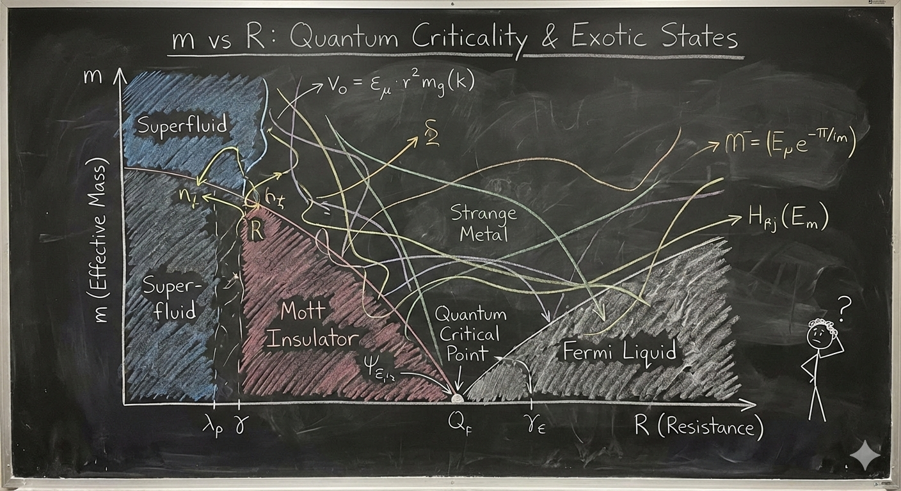

# Data storytelling and communication

This module focuses on the principles and practices of effective data storytelling and communication, with an emphasis on multivariate visualisation, ethical considerations, and practical coding skills.

### 1. Principles of data storytelling
* **Reading:** *Data Storytelling: The Essential Data Science Skill Everyone Needs* by Brent D
* **Link:** [https://www.forbes.com/sites/brentdykes/2019/04/29/data-storytelling-the-essential-data-science-skill-everyone-needs/](https://www.forbes.com/sites/brentdykes/2019/04/29/data-storytelling-the-essential-data-science-skill-everyone-needs/)
* **Activities:** Analyze a dataset and create a narrative that highlights key insights using visualisations.

### 2. Multivariate visualisation techniques
* **Lecture + reading:** *Fundamentals of Data Visualization* by Claus O. Wille
* **Link:** [https://clauswilke.com/dataviz/](https://clauswilke.com/dataviz/)
* **Activities:** Create multivariate plots (e.g., scatterplot matrices, parallel coordinates) using R or Python.

### 3. Ethical considerations in data visualization
* **Reading:** *The Ethics of Data Visualization* by Alberto Cairo
* **Link:** [https://www.ted.com/talks/alberto_cairo_the_ethics_of_data_visualization](https://www.ted.com/talks/alberto_cairo_the_ethics_of_data_visualization)
* **Activities:** Critique visualisations for ethical issues and misleading representations.

### 4. Practical coding skills for data storytelling
* **Tutorials:** R (ggplot2, plotly) or Python (matplotlib, seaborn)
* **Activities:** Hands-on coding sessions to create interactive visualisations and dashboards for storytelling.


## More resources

Data storytelling is the bridge between raw data analysis 📊 and meaningful action. While **exploratory** data analysis is about finding the signal in the noise, **explanatory** storytelling is about presenting that signal to stakeholders in a way that is clear, persuasive, and memorable.

Think of your data as the "facts" of a case. Without a narrative 📖, those facts are just a list. Storytelling provides the "argument" that tells the stakeholders why those facts matter to their specific business goals.


1. **The Narrative Structure**: Learning how to frame a data presentation using classic storytelling techniques like the "Context-Complication-Resolution" 📉 framework.
2. **Visual Hierarchy and De-cluttering**: Using Python libraries like **Matplotlib** and **Seaborn** to remove "chart junk" and direct the stakeholder's eye to the most important data points.
3. **The "So What?" Factor**: Developing exercises that teach students how to translate technical metrics (like p-values or R-squared) into business impacts (like revenue or customer churn).


## Narrative structure

Narrative structure transforms a series of charts into a compelling argument. Instead of just showing data, we use a story arc to lead stakeholders through a journey of discovery. A classic framework for this is the **Context-Complication-Resolution** model.

* **Context 🌍**: Establishing the baseline. For example, "Our app has 10,000 monthly active users and has grown steadily for a year."
* **Complication ⚠️**: The pivot point or "inciting incident" found in the data. "However, in the last two months, retention for new users has dropped by 20%."
* **Resolution ✅**: The data-driven path forward. "Our analysis shows that a specific onboarding friction point is the cause; fixing it could recover $50k in monthly revenue."

Let's decide where to go next to build these resources for your students:

1. **The Storytelling Arc Frameworks**: We can dive into specific models like **Freytag's Pyramid** or the **Action-Result** framework and how to map specific data findings to each narrative stage.
2. **Coding the Narrative**: We can explore how to use Python tools like **Jupyter Notebooks** or **Streamlit** to structure a report so the text and code work together to tell a story rather than just displaying output.
3. **The "Find the Hero" Exercise**: We can design a hands-on Python exercise where students take a raw dataset (like sales or churn data) and must identify the "Villain" (the problem) and the "Hero" (the proposed solution) using visualizations.

## 🎮🛠️ Exercise

This exercise is designed to shift students from "making charts" to "building a case." By framing data points as characters, they learn to highlight the tension (the problem) and the resolution (the recommendation).

### Exercise Title: "The Churn Chronicles: Defeating the Silent Killer"

In this scenario, students act as Lead Data Analysts for **Stream-It**, a fictional video streaming service. Recent reports show a dip in revenue, and it’s their job to find the "Villain" causing the loss and the "Hero" that will save the quarter.

---

### 1. The Setup (Student Instructions)

Your stakeholders are the Marketing and Product teams. They don't want a 50-page technical report; they want to know:

1. **Where are we losing money?** (The Villain)
2. **How do we stop it?** (The Hero)

#### The Dataset

Python code to generate a synthetic dataset with a hidden narrative:

```python
import pandas as pd
import numpy as np
import matplotlib.pyplot as plt
import seaborn as sns

# Generate synthetic data
np.random.seed(42)
n_users = 1000
data = {
    'User_ID': range(n_users),
    'Subscription_Type': np.random.choice(['Basic', 'Premium', 'Family'], n_users),
    'Monthly_Charges': np.random.uniform(10, 30, n_users),
    'Region': np.random.choice(['North', 'South', 'East', 'West'], n_users),
    'Churned': np.random.choice([0, 1], n_users, p=[0.7, 0.3]),
    'Customer_Support_Calls': np.random.poisson(2, n_users),
    'App_Engagement_Score': np.random.normal(50, 15, n_users)
}

df = pd.DataFrame(data)

# Inject the 'Villain': Higher churn for Basic users with high support calls
df.loc[(df['Subscription_Type'] == 'Basic') & (df['Customer_Support_Calls'] > 3), 'Churned'] = 1

# Inject the 'Hero': Users with high App_Engagement_Score almost never churn
df.loc[df['App_Engagement_Score'] > 70, 'Churned'] = 0

print(df.head())
```

---

### 2. The Task: Three Visual Chapters

Students must create three specific visualizations that tell the story:

#### Chapter 1: The Inciting Incident (The Villain)

**Goal:** Use a bar chart or heatmap to show that churn isn't happening everywhere—it’s concentrated.

* **Student Task:** Create a visualization comparing Churn Rates across `Subscription_Type` and `Customer_Support_Calls`.
* **The Finding:** "Basic" users with more than 3 support calls are abandoning ship at an alarming rate. This is the **Villain**.

#### Chapter 2: The Stakes

**Goal:** Translate the data into business impact.

* **Student Task:** Calculate and visualize the potential **lost revenue** (Monthly_Charges * Churned).
* **The Finding:** "If we don't address the support issues for Basic users, we stand to lose $X,000 per month."

#### Chapter 3: The Hero’s Arrival

**Goal:** Find a segment that is succeeding and turn that insight into a recommendation.

* **Student Task:** Analyze the relationship between `App_Engagement_Score` and `Churned`.
* **The Finding:** Users with high app engagement stay loyal regardless of their subscription tier. The **Hero** is a new "Engagement Campaign" to get Basic users into the mobile app earlier.

---

### 3. Evaluation Criteria

Students should be graded not just on the code, but on their **annotations**.

* **Bad Annotation:** "Chart showing churn by engagement."
* **Storytelling Annotation:** "The Safety Net: Users with engagement scores above 70 are 90% more likely to renew."

---

### 4. Discussion Questions for the Class

* **The Perspective Shift:** How did your visualization change when you started thinking of "Basic users with high calls" as a Villain rather than just a data point?
* **Stakeholder Empathy:** If you were the Head of Marketing, which chart would make you want to sign off on a budget increase?


## Exercise Solution

This model solution focuses on **Explanatory Data Viz**. Instead of just showing the data, we are going to use "Active Titles" and annotations to guide the stakeholder’s eye.

Below is the Python code using **Seaborn** and **Matplotlib**. You can share this with your students as the "Goal" they should strive for.

---

### 🎮🛠️ The Data Preparation

First, we ensure the environment is set up and the "Villain" and "Hero" are baked into the data.

```python
import pandas as pd
import numpy as np
import matplotlib.pyplot as plt
import seaborn as sns

# Set the storytelling theme
sns.set_theme(style="white")
plt.rcParams['font.family'] = 'sans-serif'

# 1. Setup (Data Generation)
np.random.seed(42)
n_users = 1000
data = {
    'Subscription_Type': np.random.choice(['Basic', 'Premium', 'Family'], n_users),
    'Monthly_Charges': np.random.uniform(10, 30, n_users),
    'Customer_Support_Calls': np.random.poisson(2, n_users),
    'App_Engagement_Score': np.random.normal(50, 15, n_users),
    'Churned': np.random.choice([0, 1], n_users, p=[0.7, 0.3])
}
df = pd.DataFrame(data)

# Inject the 'Villain': High churn for Basic users with >3 support calls
df.loc[(df['Subscription_Type'] == 'Basic') & (df['Customer_Support_Calls'] > 3), 'Churned'] = 1
# Inject the 'Hero': High engagement prevents churn
df.loc[df['App_Engagement_Score'] > 75, 'Churned'] = 0

```

---

### Chapter 1: Identifying the Villain

**The Story:** We aren't losing everyone; we are specifically failing our Basic tier users who need help.

```python
# Create a pivot table for the heatmap
heatmap_data = df.groupby(['Subscription_Type', 'Customer_Support_Calls'])['Churned'].mean().unstack()

plt.figure(figsize=(10, 5))
sns.heatmap(heatmap_data, annot=True, cmap='Reds', fmt=".1f", cbar=False)

# Storytelling elements
plt.title("THE VILLAIN: Support Friction is Killing the 'Basic' Tier", fontsize=16, loc='left', pad=20)
plt.xlabel("Number of Customer Support Calls")
plt.ylabel("Subscription Plan")
plt.annotate('CRITICAL ZONE:\nBasic users with 4+ calls\nhave a 100% churn rate.', 
             xy=(5, 0.5), xytext=(7, 0.5),
             arrowprops=dict(facecolor='black', shrink=0.05))
plt.show()

```

---

### Chapter 2: Calculating the Stakes

**The Story:** This isn't just a "metric"—it is a direct hit to our monthly revenue.

```python
# Calculate lost revenue
lost_revenue = df[df['Churned'] == 1].groupby('Subscription_Type')['Monthly_Charges'].sum()

plt.figure(figsize=(8, 6))
ax = sns.barplot(x=lost_revenue.index, y=lost_revenue.values, palette=['#ff9999', '#cccccc', '#cccccc'])

# Storytelling elements
plt.title("THE STAKES: We are losing $1,800+ Monthly in 'Basic' alone", fontsize=16, loc='left', pad=20)
plt.ylabel("Potential Monthly Revenue Lost ($)")
plt.xlabel("Subscription Tier")
sns.despine()

# Add data labels
for p in ax.patches:
    ax.annotate(f'${p.get_height():.0f}', (p.get_x() + p.get_width() / 2., p.get_height()), 
                ha = 'center', va = 'center', xytext = (0, 9), textcoords = 'offset points', fontweight='bold')
plt.show()

```

---

### Chapter 3: The Hero’s Arrival

**The Story:** High app engagement is our "shield." If we can move users into the app, the "Villain" (support friction) loses its power.

```python
plt.figure(figsize=(10, 6))
sns.kdeplot(data=df[df['Churned'] == 0], x='App_Engagement_Score', fill=True, label='Retained', color='teal')
sns.kdeplot(data=df[df['Churned'] == 1], x='App_Engagement_Score', fill=True, label='Churned', color='red')

# Storytelling elements
plt.title("THE HERO: High App Engagement is a Churn Vaccine", fontsize=16, loc='left', pad=20)
plt.axvline(75, color='green', linestyle='--')
plt.text(76, 0.02, "THE HERO ZONE:\nScores >75 = Zero Churn", color='green', fontweight='bold')
plt.legend()
sns.despine()
plt.show()

```

---

### Key Teaching Points for the Solution

1. **Decluttering**: Notice how we removed the top and right spines (`sns.despine()`) and removed the color bar from the heatmap to keep the focus on the data.
2. **Color with Intent**: We used **Red** for the Villain/Loss and **Teal/Green** for the Hero/Retention. This uses the stakeholder's existing mental models (Red = Bad, Green = Good).
3. **The "So What?"**: The titles aren't just labels like "Churn Rate by Tier." They are **conclusions**. A stakeholder could read only the titles and still understand the whole business case.


## Storyboarding

[Video by Scott Klemmer on storyboards](https://youtu.be/z4glsttyxw8?si=-oaFUFP8wTZRiz--)

- 🤔 comic strip: show flow, how does user figure in this?

- _star people_: how to draw people

- Sequence: what steps are involved?

- Helps get stakeholders on the same page.

- Here is an example of a storyboard


- 🎮 [paper prototypes video and activity](https://youtu.be/z4glsttyxw8?si=yQvl2Hze_-pwovlN&t=417)

- Paper prototypes, transparencies and sticky notes

- Digital mockups

- High fidelity mockups (controlled experiments)


## 🎮 Exercise

Storyboarding for data visualization is like writing a script 📽️ before filming a movie. It helps us map out the **Sequence**—the logical flow of insights—so stakeholders don't get lost between charts. It moves the focus from "how do I code this?" to "what am I trying to say?"

In Python, we can simulate this "sketching" phase by having students create a **Story Skeleton**. Instead of rendering complex charts immediately, they define the "Panels" of their story using a data structure. This ensures the narrative holds up before they spend hours on formatting.

Here are three ways we could structure a Python-based storyboarding exercise:

1. **The Metadata Map 🗺️**: Students write a Python script that defines a `StoryFrame` class. They must "instantiate" 4-5 frames of their story, specifying the **Sequence**, the **Persona** (the "Star Person" 👤 viewing the data), and the **Key Takeaway**.
2. **The Skeleton Plotter 🦴**: Students use Matplotlib to create "Blank" plots. Instead of data, they use `plt.text()` to describe what the chart *will* show and where the annotations will go. This mimics the **Paper Prototype** 📝 approach.
3. **The Narrative Audit 📋**: Students take an existing set of charts and write a Python "wrapper" or function that prints out the transition logic between them (e.g., "Because we see [X] in Frame 1, we must investigate [Y] in Frame 2").


1. **The Metadata Map** (Focus on planning and personas)
2. **The Skeleton Plotter** (Focus on visual layout and placeholders)
3. **The Narrative Audit** (Focus on flow and transitions)

A **Narrative Audit** focuses on the "connective tissue" between your data visualizations. In storyboarding, this ensures that the transition from one chart to the next feels like a logical progression rather than a random jump.

Think of it like a comic strip 🎞️: if Panel A shows a character at home and Panel B shows them on Mars, the reader needs a "transition" panel (the rocket ship 🚀) to understand how they got there. In data, this means explaining why a specific insight in Chart 1 leads us to investigate the metric in Chart 2.

### Exercise: The "Logic Leap" Audit

In this exercise, students are given a Python script that generates three correct but disconnected charts. Their job is to perform an "audit" and write the narrative bridge that connects them.

---

### 1. The Setup (The Disconnected Code)

Provide students with this "broken" narrative. The charts are technically fine, but the story is missing.

```python
import matplotlib.pyplot as plt
import seaborn as sns
import pandas as pd

# Sample Data: Website Traffic and Sales
data = pd.DataFrame({
    'Day': range(1, 8),
    'Visitors': [1000, 1100, 1050, 1200, 1500, 1600, 1550],
    'Bounce_Rate': [40, 42, 41, 39, 65, 68, 70],
    'Conversion_Rate': [5, 5, 4.8, 5.2, 2.1, 1.8, 1.5]
})

def plot_narrative_gap():
    # Chart 1: Traffic is growing
    plt.figure(figsize=(5, 3))
    sns.lineplot(data=data, x='Day', y='Visitors', marker='o')
    plt.title("Total Website Visitors")
    plt.show()

    # Chart 2: Bounce rate spiked
    plt.figure(figsize=(5, 3))
    sns.lineplot(data=data, x='Day', y='Bounce_Rate', color='red')
    plt.title("Bounce Rate Percentage")
    plt.show()

    # Chart 3: Conversion dropped
    plt.figure(figsize=(5, 3))
    sns.barplot(data=data, x='Day', y='Conversion_Rate')
    plt.title("Sales Conversion Rate")
    plt.show()

plot_narrative_gap()

```

---

### 2. The Student Task: The Transition Script

Students must create a Python dictionary called `narrative_audit`. For each transition, they must identify:

1. **The Observation**: What did we just see?
2. **The Question**: What does this make us wonder?
3. **The Transition**: How does the next chart answer that question?

#### Example Structure for Students:

```python
narrative_audit = {
    "Transition_1_to_2": {
        "Observation": "Traffic is hitting record highs in the second half of the week.",
        "The Question": "Is this high-volume traffic actually high-quality traffic?",
        "Bridge": "To find out, we need to look at the **Bounce Rate** to see if people are sticking around."
    },
    "Transition_2_to_3": {
        "Observation": "Bounce rates nearly doubled as traffic increased.",
        "The Question": "How did this inability to retain users impact our bottom line?",
        "Bridge": "We will now examine **Conversion Rates** to quantify the cost of this technical friction."
    }
}

```

---

### 3. Grading the "Flow"

Instead of checking if the code runs, you are checking for **Causality**.

* **Weak Flow**: "Here is traffic. Next, here is bounce rate."
* **Strong Flow**: "While traffic is up, the bounce rate suggests we are attracting the wrong audience, which leads to the drop in conversions we see here."

How do you think your students would react to critiquing "broken" stories like this versus building their own from scratch? Would they find it easier to spot logic gaps in someone else's work first?


## A bad diagram (how not to communicate)



- 🥳 2 experts might figure it out, but the rest of the 8 billion people? 

- As shown in the figure below, overly complex visuals can fail to communicate outside a small expert audience.


## AI prototyping tools

- Lovable

- Replit

- Cursor

- Google AI studio

- Base44


## Reading Materials

- [The User Experience](http://www.jjg.net/elements/pdf/elements_ch02.pdf
): A detailed look at the components of user experience design.


- [Next: Assignment](assignment.md)
