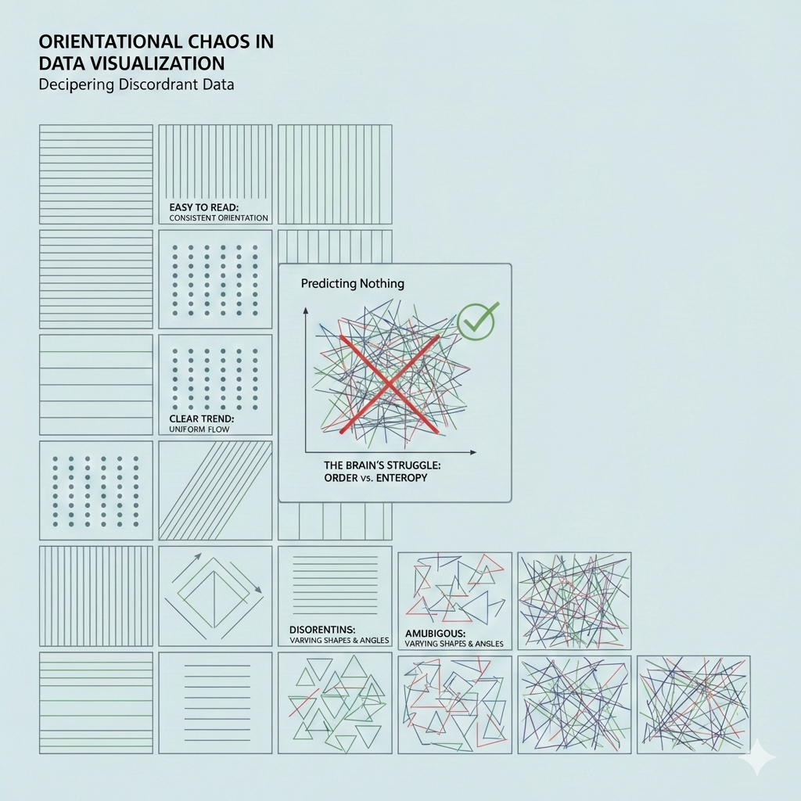
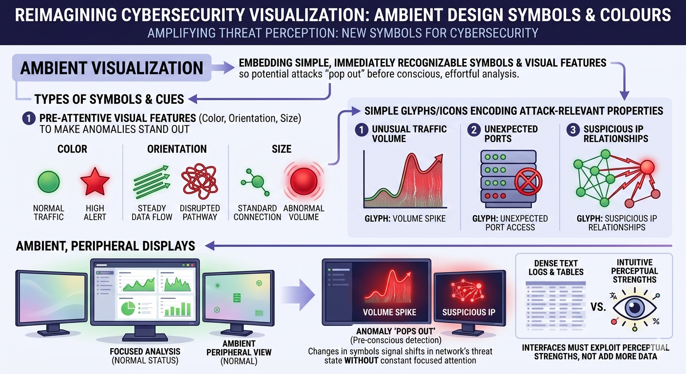

# Gestalt theory of data visualization

- [SLIDES](https://github.com/neelsoumya/visualization_lecture/blob/main/slides/The_Science_of_Seeing_Data.pptx)

- Gestalt theory, originating from psychology, emphasizes that humans perceive visual elements as organized patterns or wholes rather than just a collection of individual parts.

- In data visualization, applying Gestalt principles can enhance the clarity and effectiveness of visual representations. 

- Key principles include:
    - **Proximity**: Elements that are close to each other are perceived as related. In data visualization, grouping related data points or categories can help viewers quickly understand relationships.
    
    - **Similarity**: Elements that look similar are perceived as part of the same group. Using consistent colors, shapes, or sizes for related data can reinforce connections.
    
    - **Continuity**: The eye is drawn to continuous lines and patterns. Designing visualizations with smooth transitions and flows can guide viewers through the data more intuitively.
    
    - **Closure**: The mind tends to fill in missing information to create a complete image. Visualizations that suggest shapes or patterns can engage viewers and encourage them to explore the data further.
    
    - **Figure-Ground**: This principle involves distinguishing an object (figure) from its background (ground). Effective use of contrast and spacing can help highlight important data points.

- By leveraging these Gestalt principles, data visualizations can become more intuitive, making it easier for viewers to interpret and derive insights from complex datasets.

- Overall, Gestalt theory provides valuable guidelines for designing data visualizations that are not only aesthetically pleasing but also functionally effective in conveying information.

## Examples

- [Link to Google Colab notebook with examples](https://github.com/neelsoumya/visualization_lecture/blob/main/gestalt_visualization.ipynb)

- A scatter plot that uses color coding to group related data points, applying the principle of similarity.

```python
import matplotlib.pyplot as plt
import numpy as np
# Sample data
x = np.random.rand(50)
y = np.random.rand(50)
colors = np.random.choice(['red', 'blue'], size=50)
plt.scatter(x, y, c=colors)
plt.title('Scatter Plot with Similarity Principle')
plt.show()
```


- A bar chart where bars representing related categories are placed close together, utilizing the principle of proximity.

```python
import matplotlib.pyplot as plt
# Sample data
categories = ['A', 'B', 'C', 'D']
values1 = [5, 7, 3, 4]
values2 = [6, 8, 4, 5]
x = np.arange(len(categories))
width = 0.35
plt.bar(x - width/2, values1, width, label='Group 1')
plt.bar(x + width/2, values2, width, label='Group 2')
plt.xticks(x, categories)
plt.title('Bar Chart with Proximity Principle')
plt.legend()
plt.show()
```

- A line graph that smoothly connects data points, demonstrating the principle of continuity.

```python
import matplotlib.pyplot as plt
# Sample data
x = np.linspace(0, 10, 100)
y = np.sin(x)
plt.plot(x, y)
plt.title('Line Graph with Continuity Principle')
plt.show()
```

- A pie chart that suggests a complete circle even if some segments are missing, illustrating the principle of closure.

```python
import matplotlib.pyplot as plt
# Sample data
sizes = [30, 20, 25, 15]
labels = ['A', 'B', 'C', 'D']
plt.pie(sizes, labels=labels, startangle=90)
plt.title('Pie Chart with Closure Principle')
plt.show()
```

- A heatmap that uses contrasting colors to differentiate between high and low values, applying the figure-ground principle.

```python
import seaborn as sns
import numpy as np
import matplotlib.pyplot as plt
# Sample data
data = np.random.rand(10, 10)
sns.heatmap(data, cmap='coolwarm')
plt.title('Heatmap with Figure-Ground Principle')
plt.show()
```

## 🤔❓ Applications to modern data science

- tSNE and UMAP visualizations often leverage Gestalt principles to help users identify clusters and patterns in high-dimensional data.

- Also makes interpretation of tSNE plots difficult when these principles are not effectively applied.

- Dashboards and data reporting tools use these principles to create intuitive layouts that facilitate quick comprehension of key metrics.

- Interactive visualizations (_plotly_) often incorporate Gestalt principles to enhance user engagement and understanding, such as through hover effects that highlight related data points.

## Visual perception principles

- Gestalt principles are part of a broader set of visual perception principles that influence how we interpret visual information. Other important principles include:

    - **Preattentive Processing**: Certain visual properties (like color, shape, and size) are processed rapidly by the human brain before conscious attention is directed. Effective data visualizations leverage preattentive attributes to highlight important information quickly.

    - **Color Theory**: The use of color can significantly impact the readability and interpretability of data visualizations. Understanding color relationships (complementary, analogous, etc.) helps in creating visually appealing and effective graphics.

    - **Visual Hierarchy**: Establishing a clear visual hierarchy through size, color, and placement helps guide the viewer's eye to the most important elements first.

    - **Balance and Alignment**: Proper alignment and balance in design contribute to a cohesive and organized appearance, making it easier for viewers to process information.

    - **Contrast**: Using contrast effectively can help differentiate between different data points or categories, enhancing clarity.

## Use of colour in data visualization

- Use blue in large regions

- Use red and green in the centers of attention

- 🧩🚀 _Concept_ edges of retina not sensitive to red and green

- Use black, white and yellow in peripheral regions


## 🎮 Colour activity

- [Colour activity](https://color.method.ac/)


## 💡 Glyphs and visual variables

- Visual variables are attributes that can be manipulated to represent data in visualizations. Common visual variables include:

    - **Position**: The location of an element on a chart or graph, often used to represent quantitative data.

    - **Size**: The dimensions of an element, which can indicate magnitude or importance.

    - **Shape**: Different shapes can represent different categories or types of data.

    - **Color**: Color can convey information about categories, values, or intensity.

    - **Orientation**: The angle or direction of an element can provide additional context or meaning.

    - **Texture**: Patterns or textures can differentiate between areas in a visualization.

- Glyphs are visual representations that combine multiple visual variables to encode complex data. Examples of glyphs include:  

    - **Chernoff Faces**: Use facial features (like eyes, nose, mouth) to represent multivariate data.

    - **Star Plots**: Use radial lines extending from a central point to represent multiple variables.

    - **Glyph Maps**: Combine position with other visual variables to represent data on geographical maps.

    - [Glyph maps by Hadley Wickham](https://vita.had.co.nz/papers/glyph-maps.pdf)


## Change blindness

- 🎮💡 See this [video](https://www.youtube.com/watch?v=vJG698U2Mvo) 

- Change blindness is a phenomenon where significant changes in a visual scene go unnoticed by the observer.

- This occurs because our attention is limited, and we often focus on specific elements while ignoring others.

- In data visualization, change blindness can impact how effectively information is communicated. 

- If important changes in data are not visually highlighted, viewers may miss critical insights.
- To mitigate change blindness in data visualizations, designers can use techniques such as:
    - **Animation**: Smooth transitions can help draw attention to changes over time.
    - **Highlighting**: Using color or size changes to emphasize important data points.
    - **Annotations**: Adding text or markers to indicate significant changes.


- 🎮💡🛠️ Watch the following [videos](https://www.youtube.com/watch?v=vJG698U2Mvo&list=PLB228A1652CD49370) to see examples of [change blindness](http://www.simonslab.com/videos.html).


## Optical illusions

- Optical illusions are visual phenomena that deceive the eye and brain, leading to misinterpretations of visual information.
- In data visualization, optical illusions can inadvertently affect how data is perceived, potentially leading to misunderstandings or misinterpretations.
- Common types of optical illusions that can impact data visualization include:
    - **Ambiguous Illusions**: Images that can be interpreted in multiple ways, which can lead to confusion in data representation.
    - **Distorting Illusions**: Visual elements that distort perception, such as misleading scales or axes.
    - **Paradoxical Illusions**: Images that create impossible scenarios, which can confuse viewers.
- To avoid optical illusions in data visualization, designers should:
    - Use clear and consistent scales.
    - Avoid overly complex designs that can confuse viewers.
    - Test visualizations with diverse audiences to ensure clarity.


## 🤔❓Retinal variables

- Jacques Bertin — Semiology of Graphics (excerpt PDF)
  [link](https://digitalsocietyschool.org/wp/wp-content/uploads/2020/09/Bertin_Semiology_of_Graphics_Excerpt_2016.pdf)

- ⚠️ _NOTE_ Depth perception in 2D visualizations can be enhanced using retinal variables.

- apparent movement of objects when the observer changes position

- a decrease in the size of object

- a decrease in the intensity of color

- a change in the texture or pattern of an object

- a change in contrast between an object and its background

- a change in orientation or shape of an object


- 🤔❓_Retinal variables_ are visual properties that can be manipulated to convey information in data visualizations. They include:

    - **Color Hue**: Different colors can represent different categories or types of data.

    - **Color Intensity**: The brightness or saturation of a color can indicate magnitude or importance.

    - **Size**: The dimensions of an element can represent quantitative values.

    - **Shape**: Different shapes can be used to differentiate between categories.

    - **Orientation**: The angle or direction of an element can provide additional context.

    - **Texture/Pattern**: Patterns can be used to distinguish between areas in a visualization.


## Associative vs. Dissociative visualizations

- [Page 7 of PDF here](https://digitalsocietyschool.org/wp/wp-content/uploads/2020/09/Bertin_Semiology_of_Graphics_Excerpt_2016.pdf) - _Semiology of Graphics_ by Jacques Bertin

- Associative visualizations use visual elements that are closely related to the data being represented, making it easier for viewers to understand the information. Examples include using icons or images that directly relate to the data.

- Dissociative visualizations use abstract or unrelated visual elements, which may require viewers to interpret the data without direct visual cues. Examples include using geometric shapes or colors that do not have an inherent connection to the data.


## Vibratory effect in point representations

- [PDF pg 10](https://digitalsocietyschool.org/wp/wp-content/uploads/2020/09/Bertin_Semiology_of_Graphics_Excerpt_2016.pdf) - _Semiology of Graphics_ by Jacques Bertin

- In data visualization, the vibratory effect is that annoying optical illusion where a dense collection of points or lines seems to shimmer, shake, or "vibrate" on the screen. It’s essentially the visual equivalent of static noise.

- Here is the quick breakdown of why it happens and why it matters:

- The Cause: It usually occurs when points are placed in a high-density, repetitive, or strictly geometric grid. When the spacing between points nears the limits of the eye’s resolution, the brain struggles to process the gaps, leading to a perceived "flicker."

- 🤔❓ The _Chartjunk_ Factor: Edward Tufte famously categorized this as a form of unnecessary visual clutter. It creates Moire patterns that distract the viewer from the actual data trends.


## Orientation variation

[page 14 of PDF here](https://digitalsocietyschool.org/wp/wp-content/uploads/2020/09/Bertin_Semiology_of_Graphics_Excerpt_2016.pdf) - _Semiology of Graphics_ by Jacques Bertin

- _Orientation_ of symbols matter.

- Limit the number of categories of orientation

- See diagram below



- Does this remind you of an ancient art/writing form?

- 🎉 🥳 Here is a fun image (AI generated of course) of what data visualization may have looked like in ancient Egypt!


- Still intrigued? Read this short [writeup on the similarity between data visualization and hieroglyphics](https://www.researchgate.net/publication/400396829_The_Scribe_and_the_Data_Scientist_A_4000-Year_Quest_to_Impose_Order_on_Information_Chaos)


## Shape variation

- There are infinite shapes

- Shape variation is _associative_

- Shape variation can be used to reveal similar elements

- Shape variation is not _selective_ i.e. cannot be used to answer where is a similar shape in a different region

- _Concept_ 🧩🚀 The meaning of a symbol becomes familiar to us only through habit.


## 🤔❓ Semiotics of data visualization

Semiotics is the study of **signs** 🪧 and **symbols** 🧩 and how they communicate meaning. When we apply this to data visualization, we are looking at how visual marks (like points, lines, and areas) serve as "signs" for data values.

At its core, visual semiotics involves three main components:

1. **The Signifier** 🎨: The physical form of the sign (e.g., a red bar on a chart).
2. **The Signified** 📊: The concept or data the sign represents (e.g., "Company Expenses").
3. **The Code** 📖: The set of rules that allow a viewer to connect the two (e.g., "longer bars represent larger amounts").

By understanding these relationships, we can design visualizations that are more intuitive and less likely to be misinterpreted.


1. **Bertin's Visual Variables** 📐
Discover the "alphabet" of data visualization—size, value, texture, color, orientation, and shape—and how they function as signs.
2. **Levels of Measurement** 🔢
Learn how the nature of your data (nominal, ordinal, interval, or ratio) dictates which visual signs are the most effective.
3. **Visual Rhetoric & Context** 🏛️
Explore how cultural associations and the way we frame "signs" can subtly influence or even mislead an audience.


_Jacques Bertin_, a French cartographer, changed the way we think about charts in 1967 when he published *Sémiologie Graphique*. He proposed that every data visualization is built from basic **marks** (points 📍, lines 📏, or areas 🟦) that we change using specific **visual variables**.

Think of these variables as the "alphabet" of your visualization. Just as letters form words, these variables form the "signs" that readers decode to understand your data.

### The Original 7 Variables

Bertin identified seven primary ways we can vary a mark to convey meaning:

* **Position** 📍: Where the mark sits on the page (x and y coordinates). This is generally considered the most powerful variable for human perception.
* **Size** 📏: How big or small the mark is (length, area, or volume). Our brains naturally associate "bigger" with "more."
* **Value** 🌓: The relative lightness or darkness of a color (grayscale). This is excellent for showing ranges or intensity.
* **Texture** 🏁: The pattern within a mark (e.g., stripes vs. dots).
* **Color (Hue)** 🎨: The actual color used (red, blue, green). This is very effective for showing different categories.
* **Orientation** 📐: The angle of a line or shape (e.g., horizontal vs. vertical).
* **Shape** 🔺: The geometric form of the mark (circle, square, triangle).

---

### How Our Brains Process These Signs

_Concept_: 🧩🚀 Not all variables are created equal. Some are better at showing **differences** (like Color Hue), while others are better at showing **amounts** (like Size).

If you use the "wrong" variable for your data—like using different shapes to represent "How much money was spent"—the viewer's brain has to work much harder to decode the sign.

### 🎮🛠️ Exercise

To see how this works in practice, let's imagine you are designing a map of a city. You want to show two things:

1. **Where the parks are located.**
2. **How many people visit each park per day.**

Which visual variable would you choose to represent the **number of visitors** at each park, and why?

_Solution_: 

Since the number of visitors is a quantitative value (meaning it represents a specific amount), we want a variable that our eyes naturally perceive as "more" or "less."

When we look at a map, our brains are very good at comparing magnitudes if they are represented physically.

Between Size 📏 and Shape 🔺, which one do you think would allow a reader to immediately see that one park is much busier than another?

To represent the number of visitors, the best choice is Size 📏 (specifically, the area of a circle or the length of a bar).

Here is why:

Magnitude Perception 🧠: Our brains are naturally wired to associate "larger physical space" with "larger quantity." If you see a giant circle next to a tiny dot, you immediately know one has more visitors without even looking at a legend.

Ordered Nature 📈: Data like visitor counts is quantitative and ordered. Size has a natural order (small to large) that matches the data (few to many).

The Problem with Shape 🔺: Shapes are "nominal." A triangle isn't "more" than a square; it's just different. If you used triangles for 100 people and squares for 1,000, the viewer would have to memorize a complex code to understand the map.

### Exercise: Testing Another Variable

Now, imagine the city wants to show the type of park (e.g., Playground 🧸, Nature Reserve 🌲, or Sports Field ⚽).

In this case, we aren't showing "how much," but "what kind." Which of Bertin's variables—Value (lightness/darkness) or Color Hue (red, blue, green)—would be most effective for distinguishing these categories?

_Solution_

Spot on! **Color Hue** (red, blue, green, etc.) is the perfect signifier for categories because our eyes see these colors as "different" but not necessarily "better" or "more" than one another. 🎨

In semiotics, we call this a **Nominal** variable. It establishes identity without establishing a rank.

---

### Hue vs. Value: The Hierarchy Trap

While **Hue** is great for "what kind," **Value** (the lightness or darkness of a color) carries a hidden message. Our brains automatically interpret darker or more intense colors as "heavier" or "more important."

| Variable | Best For... | Example |
| --- | --- | --- |
| **Color Hue** 🌈 | **Categories** (Nominal) | Different colors for different subway lines. |
| **Value** 🌓 | **Intensity** (Ordinal/Ratio) | Darker blue for deeper water, lighter blue for shallow. |

If you use different **Values** of green for park types, a reader might accidentally think the "Dark Green" park is "better" or "larger" than the "Light Green" one, even if you didn't mean that!

---

### Putting the Alphabet Together

Now that we know the "letters" (Size, Hue, Value, etc.), the real magic happens when we combine them. This is where we create a **Visual Language**.

Imagine you are looking at a weather map. 🌡️ It uses a **Color Gradient** (a "Heatmap") to show temperature across a country.

* **Signifier**: A spectrum ranging from deep blue to bright red.
* **Signified**: Temperature values from °C to °C.

**Here is the puzzle:** Why do we almost always use **Red** for hot and **Blue** for cold? Is there a mathematical reason, or is this a different kind of "sign" altogether?


## Isarithms (Contours)

[pg 18 of PDF](https://digitalsocietyschool.org/wp/wp-content/uploads/2020/09/Bertin_Semiology_of_Graphics_Excerpt_2016.pdf)

- Hard to derive quantitative value from images


## Value Variation

- Graduated sizes in a regular pattern

- Regular pattern of different sized circles

## 🎮💡🛠️ Activity

- Read the article and the [visualization on the progress of the war in Iran](https://www.economist.com/middle-east-and-africa/2026/03/12/what-data-reveal-about-the-wars-progress). Notice how different colours have been used for the different nations and the size of the bubbles indicates the severity.

## 🎮💡🛠️ Activity

- Design symbols and colours for a cybersecurity handbook

- Read the work of Sunny Fugate who suggests that we need [new symbols for cybersecurity](https://dl.acm.org/doi/10.1145/3046055.3046064)

- Core idea: Sunny Fugate proposes “ambient visualization” that embeds simple, immediately recognizable symbols and visual features into cyber defense displays so that potential attacks “pop out” before conscious, effortful analysis is needed.

- Types of symbols and cues

- Size of symbols: _looming_ objects easily grab our attention

- Pre-attentive visual features (color, orientation, size) to make anomalies stand out.

- Simple glyphs/icons that encode attack-relevant properties (e.g., unusual traffic volume, unexpected ports, suspicious IP relationships).

- Ambient, peripheral displays where changes in these symbols signal shifts in the network’s threat state without demanding constant focused attention.

- interfaces must exploit human perceptual strengths instead of just adding more text logs or dense tables

- Here is what a cybersecurity handbook with new symbols might look like




## Resources

- [The pyschology behind data visualization](https://towardsdatascience.com/the-psychology-behind-data-visualization-techniques-68ef12865720/)

- [Principles of proportional ink](https://clauswilke.com/dataviz/proportional-ink.html#:~:text=This%20concept%20has%20been%20termed,the%20data%20values%20they%20represent)


- **John Stasko — Visual Perception (CS7450 lecture notes, Georgia Tech)**  
  [link](https://faculty.cc.gatech.edu/~stasko/7450/16/Notes/perception.pdf)

- **Jacques Bertin — Semiology of Graphics (excerpt PDF)**  
  [link](https://digitalsocietyschool.org/wp/wp-content/uploads/2020/09/Bertin_Semiology_of_Graphics_Excerpt_2016.pdf)

- **Alberto Cairo — The Functional Art (sample pages)**  
  [link](https://ptgmedia.pearsoncmg.com/images/9780321834737/samplepages/0321834739.pdf)

- **Preattentive properties & Gestalt perception (lecture slides)**  
  [link](https://dmice.ohsu.edu/bedricks/courses/cs631_fall_2016/lectures/week2_lec1b.pdf)

- **Gestalt Principles in Data Visualization (student paper)**  
  [link](https://ecommons.luc.edu/cgi/viewcontent.cgi?article=1786&context=ures)

- **Exploring the use of Gestalt’s principles (ResearchGate / case study)**  
  [link](https://www.researchgate.net/publication/328571584_Exploring_the_Use_of_Gestalt%27s_Principles_in_Improving_the_Visualization_User_Experience_and_Comprehension_of_COBie_Data_Extension)

- **Interaction Design Foundation — What are the Gestalt Principles?**  
  [link](https://www.interaction-design.org/literature/topics/gestalt-principles)

- **Principles of Data Visualization — Artificium (PDF)**  
  [link](https://artificium.us/lessons/54.info-viz/l-54-103-build-explntry-viz/resources/principles-of-data-visualization.pdf)

- **Lecture: Pre-attentive attributes & Gestalt (PDF)**  
  [link](https://bbrejova.github.io/viz/pdf/L09_Preattentive_and_Gestalt.pdf)

- **The Gestalt Principles — Data Action Lab (handout PDF)**  
  [link](https://www.data-action-lab.com/wp-content/uploads/2021/05/ACFO-DV-4.pdf)


- [Next: Data storytelling](data_storytelling.md)
